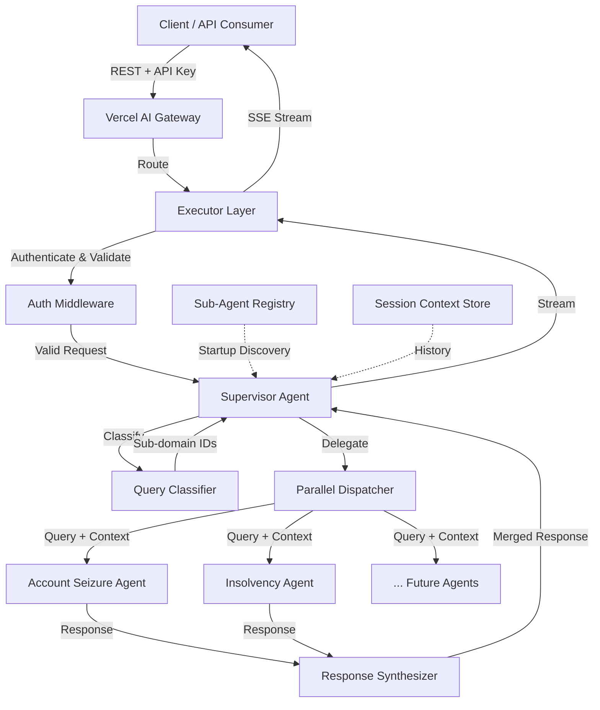

# Design Document: Legal Advisor System

## Overview

The Legal Advisor System is a Python-based agentic chatbot that answers legal questions in the domain of German banking operations — specifically account seizures (Kontopfändungen) and insolvency proceedings (Insolvenzverfahren). It follows a supervisor/sub-agent architecture deployed via the Vercel AI Gateway.

The system receives natural-language queries from banking professionals, classifies them into legal sub-domains, delegates to specialized sub-agents, and synthesizes responses with legal source citations and confidence qualifiers. It supports German and English, maintains conversation context within sessions, and streams responses to clients.

### Key Design Decisions

1. **Registry-based sub-agent discovery** — The supervisor discovers sub-agents at startup via a registry, enabling new legal domains without supervisor code changes.
2. **Parallel sub-agent invocation** — Multi-domain queries are dispatched concurrently with per-agent timeouts to keep total latency under 30 seconds.
3. **Streaming-first response delivery** — Responses are streamed token-by-token via SSE to meet the 3-second first-token requirement.
4. **Context summarization with entity preservation** — Sessions exceeding the context window are summarized while retaining legal references, case identifiers, amounts, and party names.

## Architecture



### Layer Responsibilities

| Layer | Responsibility |
|-------|---------------|
| Vercel AI Gateway | Routing, TLS termination, API key management |
| Executor Layer | REST API, authentication, rate limiting, streaming, session management |
| Supervisor | Query classification, delegation, response synthesis, context injection |
| Sub-Agents | Domain-specific legal reasoning, knowledge base lookup, citation generation |
| Registry | Sub-agent metadata storage and discovery |
| Context Store | Per-session conversation history and summarization |

## Components and Interfaces

### 1. Executor Layer (`executor/`)

Exposes the REST API and manages cross-cutting concerns.

```python
class ExecutorLayer:
    """Top-level HTTP handler compatible with Vercel AI Gateway."""

    async def handle_request(
        self,
        request: ChatRequest,
    ) -> StreamingResponse:
        """Authenticate, validate, and dispatch to Supervisor."""
        ...

    async def authenticate(
        self,
        api_key: str,
    ) -> bool:
        """Validate API key via Vercel AI Gateway credentials."""
        ...

    def validate_request(
        self,
        payload: dict,
    ) -> ChatRequest:
        """Parse and validate incoming request payload."""
        ...
```

### 2. Supervisor (`supervisor/`)

Orchestrates classification, delegation, and synthesis.

```python
class Supervisor:
    """Orchestrates query classification and sub-agent delegation."""

    def __init__(
        self,
        registry: SubAgentRegistry,
        context_store: ContextStore,
    ) -> None:
        ...

    async def process_query(
        self,
        query: str,
        session_id: str,
        language: str,
    ) -> AsyncIterator[StreamChunk]:
        """Classify, delegate, synthesize, and stream response."""
        ...

    async def classify_query(
        self,
        query: str,
        available_domains: list[SubAgentMetadata],
    ) -> ClassificationResult:
        """Determine which sub-domains a query belongs to."""
        ...

    async def synthesize_responses(
        self,
        partial_responses: list[SubAgentResponse],
        query: str,
    ) -> SynthesizedResponse:
        """Merge multiple sub-agent responses into a coherent answer."""
        ...
```

### 3. Sub-Agent Interface (`agents/base.py`)

Standard interface all sub-agents implement.

```python
from abc import ABC, abstractmethod

class BaseSubAgent(ABC):
    """Base class for all legal domain sub-agents."""

    @abstractmethod
    async def handle_query(
        self,
        query: str,
        context: ConversationContext,
    ) -> SubAgentResponse:
        """Process a classified query and return a structured response."""
        ...

    @abstractmethod
    def get_metadata(self) -> SubAgentMetadata:
        """Return metadata for registry registration."""
        ...
```

### 4. Sub-Agent Registry (`registry/`)

```python
class SubAgentRegistry:
    """Registry for discovering and managing sub-agents."""

    def __init__(self) -> None:
        self._agents: dict[str, BaseSubAgent] = {}

    def register(
        self,
        agent: BaseSubAgent,
    ) -> None:
        """Register a sub-agent by its domain identifier."""
        ...

    def get_agents_for_domains(
        self,
        domain_ids: list[str],
    ) -> list[BaseSubAgent]:
        """Retrieve sub-agents matching the given domain identifiers."""
        ...

    def get_all_metadata(self) -> list[SubAgentMetadata]:
        """Return metadata for all registered sub-agents."""
        ...
```

### 5. Context Store (`context/`)

```python
class ContextStore:
    """Manages per-session conversation history."""

    async def get_context(
        self,
        session_id: str,
    ) -> ConversationContext:
        """Retrieve conversation history for a session."""
        ...

    async def append_exchange(
        self,
        session_id: str,
        exchange: Exchange,
    ) -> None:
        """Add a new exchange to the session history."""
        ...

    async def summarize_if_needed(
        self,
        session_id: str,
    ) -> bool:
        """Summarize older exchanges if context window limit is reached."""
        ...
```

### 6. Parallel Dispatcher (`supervisor/dispatcher.py`)

```python
class ParallelDispatcher:
    """Dispatches queries to multiple sub-agents concurrently."""

    async def dispatch(
        self,
        agents: list[BaseSubAgent],
        query: str,
        context: ConversationContext,
        timeout_seconds: float = 30.0,
    ) -> list[SubAgentResult]:
        """
        Invoke all agents in parallel with per-agent timeout.
        Returns results (success or timeout) for each agent.
        """
        ...
```

## Data Models

```python
from dataclasses import dataclass, field
from enum import Enum
from typing import Optional


class Language(Enum):
    """Supported query languages."""
    GERMAN = "de"
    ENGLISH = "en"


class ConfidenceLevel(Enum):
    """Confidence qualifier for sub-agent responses."""
    HIGH = "high"
    MEDIUM = "medium"
    LOW = "low"


@dataclass
class ChatRequest:
    """Validated incoming request from the client."""
    query: str
    session_id: str
    language: Language


@dataclass
class LegalReference:
    """A citation to a specific legal provision."""
    law_name: str          # e.g., "ZPO", "InsO"
    paragraph: str         # e.g., "§ 850c"
    section: Optional[str] = None  # e.g., "Abs. 1"


@dataclass
class SubAgentMetadata:
    """Metadata describing a sub-agent's capabilities."""
    domain_id: str                    # e.g., "account_seizure"
    description: str                  # Natural-language description
    supported_categories: list[str]   # e.g., ["seizure_order", "protected_amounts"]


@dataclass
class ClassificationResult:
    """Result of query classification."""
    domain_ids: list[str]
    confidence: float
    language: Language


@dataclass
class SubAgentResponse:
    """Structured response from a single sub-agent."""
    domain_id: str
    answer_body: str
    references: list[LegalReference]
    confidence: ConfidenceLevel
    is_out_of_scope: bool = False
    limitation_note: Optional[str] = None


@dataclass
class SubAgentResult:
    """Wrapper for dispatch results including timeout handling."""
    domain_id: str
    response: Optional[SubAgentResponse] = None
    timed_out: bool = False
    error: Optional[str] = None


@dataclass
class SynthesizedResponse:
    """Final merged response from the supervisor."""
    answer_body: str
    references: list[LegalReference]
    confidence: ConfidenceLevel
    unresolved_domains: list[str] = field(default_factory=list)
    recommend_professional: bool = False


@dataclass
class Exchange:
    """A single user-system exchange in a session."""
    user_query: str
    system_response: str
    references: list[LegalReference] = field(default_factory=list)


@dataclass
class ConversationContext:
    """Full conversation context for a session."""
    exchanges: list[Exchange]
    summary: Optional[str] = None
    is_truncated: bool = False
    preserved_entities: list[str] = field(default_factory=list)


@dataclass
class StreamChunk:
    """A single chunk in a streaming response."""
    content: str
    is_final: bool = False
    metadata: Optional[dict] = None
```

## Correctness Properties

*A property is a characteristic or behavior that should hold true across all valid executions of a system — essentially, a formal statement about what the system should do. Properties serve as the bridge between human-readable specifications and machine-verifiable correctness guarantees.*

### Property 1: Query length validation

*For any* string of length 0 or length greater than 2000, submitting it as a query SHALL result in rejection with an error message that mentions the acceptable length range (1–2000 characters), and the query SHALL NOT be forwarded to classification.

**Validates: Requirements 1.6**

### Property 2: Language validation

*For any* query string, if the detected language is neither German nor English, the system SHALL reject the query with an error message listing the supported languages ("German", "English"), and the query SHALL NOT be forwarded to classification.

**Validates: Requirements 1.4, 1.5**

### Property 3: Classification produces valid registered domains

*For any* valid query (1–2000 characters, German or English) and any non-empty registry of sub-agents, the classifier SHALL return a ClassificationResult where every domain_id in the result is present in the registry. If no domain matches, the response SHALL list all registered sub-domain names.

**Validates: Requirements 1.1, 1.3**

### Property 4: Dispatch matches classification

*For any* ClassificationResult containing N domain_ids that exist in the registry, the dispatcher SHALL invoke exactly those N sub-agents and no others.

**Validates: Requirements 1.2, 2.1**

### Property 5: Graceful degradation on partial timeout

*For any* set of dispatched sub-agent results where at least one succeeds and at least one times out, the synthesized response SHALL contain the answer content from all successful agents AND list all timed-out domain_ids in the unresolved_domains field.

**Validates: Requirements 2.4, 2.5**

### Property 6: Reference preservation through synthesis

*For any* list of SubAgentResponses, the set of LegalReferences in the synthesized response SHALL be a superset of the union of all references from the input responses (no reference is dropped or altered during synthesis).

**Validates: Requirements 2.2, 7.4**

### Property 7: Substantive answers always cite legal sources

*For any* sub-agent response where is_out_of_scope is False and confidence is HIGH or MEDIUM, the references list SHALL contain at least one LegalReference with a non-empty law_name and a non-empty paragraph.

**Validates: Requirements 3.1, 3.2, 4.1, 4.2, 7.1**

### Property 8: Confidence qualifier is always present

*For any* SubAgentResponse returned by any sub-agent, the confidence field SHALL be one of HIGH, MEDIUM, or LOW — never null or unset.

**Validates: Requirements 7.2**

### Property 9: Low confidence triggers professional consultation recommendation

*For any* SubAgentResponse where confidence is LOW, the response SHALL include a recommendation to consult a qualified legal professional (either via recommend_professional=True in the synthesized response or explicit text in the answer_body).

**Validates: Requirements 7.3**

### Property 10: Unresolvable queries state limitation with LOW confidence

*For any* sub-agent response where no matching legal provision is found (references list is empty and is_out_of_scope is False), the confidence SHALL be LOW and limitation_note SHALL be non-empty, explicitly stating what could not be resolved.

**Validates: Requirements 3.3, 4.3, 7.5**

### Property 11: Out-of-scope queries are flagged

*For any* query delegated to a sub-agent that falls outside that agent's covered topics, the response SHALL have is_out_of_scope=True, enabling the supervisor to re-route or inform the user.

**Validates: Requirements 3.5, 4.5**

### Property 12: Context round-trip preservation

*For any* sequence of N exchanges (where N ≤ 20) appended to a session, retrieving the conversation context SHALL return all N exchanges in their original order with user_query and system_response fields unchanged.

**Validates: Requirements 5.1, 5.2, 5.3**

### Property 13: Summarization preserves key entities

*For any* session exceeding the context window limit, after summarization the ConversationContext SHALL have is_truncated=True, summary SHALL be non-empty, and preserved_entities SHALL contain all legal references, case identifiers, monetary amounts, and party names that appeared in the original exchanges.

**Validates: Requirements 5.4, 5.5**

### Property 14: Malformed request rejection

*For any* request payload that is missing required fields (query, session_id) or contains fields of incorrect type, the executor SHALL reject with HTTP 400 and an error message describing the validation failure.

**Validates: Requirements 6.6**

### Property 15: Registry discovery completeness

*For any* set of N sub-agents registered in the registry, after startup the supervisor's get_all_metadata SHALL return exactly N entries, each with the correct domain_id, description, and supported_categories matching the registered agents.

**Validates: Requirements 8.1, 8.2**

## Error Handling

### Error Categories and Responses

| Error Category | HTTP Status | Trigger | Response |
|---|---|---|---|
| Missing authentication | 401 | No API key in request | `{"error": "missing_credentials", "message": "API key required"}` |
| Invalid authentication | 403 | Invalid/expired API key | `{"error": "invalid_credentials", "message": "API key invalid or expired"}` |
| Malformed request | 400 | Missing fields, wrong types, invalid JSON | `{"error": "validation_error", "message": "<specific field errors>"}` |
| Query too short/long | 400 | Length outside 1–2000 | `{"error": "query_length_error", "message": "Query must be between 1 and 2000 characters"}` |
| Unsupported language | 400 | Language not DE/EN | `{"error": "unsupported_language", "message": "Supported languages: German, English"}` |
| Rate limit exceeded | 429 | Capacity exceeded | `{"error": "rate_limited", "message": "Too many requests, retry later"}` |
| Partial timeout | 200 (streaming) | Some sub-agents timeout | Response includes successful answers + `unresolved_domains` list |
| Total timeout | 504 | All sub-agents timeout | `{"error": "timeout", "message": "No sub-domain could be resolved", "attempted_domains": [...]}` |
| System not ready | 503 | Empty/unavailable registry | `{"error": "system_unavailable", "message": "No sub-agents available"}` |

### Error Propagation Strategy

1. **Validation errors** (400-level) are returned immediately before any agent processing.
2. **Sub-agent failures** are isolated — one agent's failure does not crash the pipeline. The dispatcher catches exceptions per-agent and marks them as timed_out or errored.
3. **Synthesis errors** fall back to returning raw sub-agent responses without merging.
4. **Context store errors** are logged but do not block query processing — the system degrades to stateless mode for that request.

### Retry Policy

- Sub-agent invocations are NOT retried within a single request (to stay within the 30s budget).
- Clients may retry failed requests. Rate limiting prevents abuse.
- Context store operations use at-most-once semantics — a failed append is logged but not retried to avoid duplicate exchanges.

## Testing Strategy

### Property-Based Testing

The system is well-suited for property-based testing due to its clear input/output contracts, data transformations (classification, synthesis, context management), and universal invariants.

**Library:** [Hypothesis](https://hypothesis.readthedocs.io/) (Python)

**Configuration:**
- Minimum 100 examples per property test
- Each test tagged with: `# Feature: legal-advisor-system, Property {N}: {title}`
- Custom strategies for generating:
  - Valid/invalid query strings (varying length, language, content)
  - SubAgentResponse instances (varying references, confidence, scope)
  - Exchange sequences (varying length, entity content)
  - ClassificationResult instances (varying domain counts)
  - Malformed request payloads

**Property test coverage:**
- Properties 1–15 as defined in the Correctness Properties section
- Each property implemented as a single Hypothesis test function

### Unit Testing (Example-Based)

Unit tests complement property tests for specific scenarios:

- **Timeout enforcement** (Req 2.3): Mock agent with 31s delay, verify timeout triggers
- **Parallel dispatch timing** (Req 2.6): Mock 3 agents with 10s each, verify total < 15s
- **HTTP 401/403 responses** (Req 6.3, 6.4): Specific auth failure scenarios
- **HTTP 429 response** (Req 6.7): Rate limit threshold test
- **Agent topic coverage** (Req 3.4, 4.4): Verify metadata includes required categories
- **Streaming format** (Req 6.5): Verify SSE chunk format compliance

### Integration Testing

- **Vercel AI Gateway compatibility** (Req 6.1, 6.2): End-to-end request through gateway
- **Full pipeline** (Req 1→7): Submit query, verify classified, delegated, synthesized, streamed
- **Multi-domain query** (Req 2.6): Query spanning seizure + insolvency, verify parallel execution and merged response

### Test Organization

```
tests/
├── property/
│   ├── test_query_validation.py      # Properties 1, 2
│   ├── test_classification.py        # Properties 3, 4
│   ├── test_dispatch.py              # Properties 4, 5
│   ├── test_synthesis.py             # Properties 6
│   ├── test_sub_agent_response.py    # Properties 7, 8, 9, 10, 11
│   ├── test_context.py              # Properties 12, 13
│   ├── test_request_validation.py    # Property 14
│   └── test_registry.py             # Property 15
├── unit/
│   ├── test_timeout.py
│   ├── test_auth.py
│   ├── test_rate_limit.py
│   └── test_streaming.py
└── integration/
    ├── test_gateway.py
    └── test_pipeline.py
```
